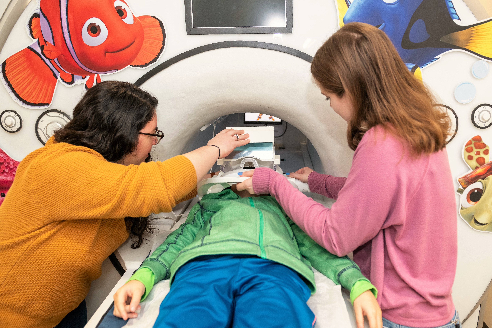

Hi, I'm Caroline! I am a PhD student in the Department of Psychology at Stanford University. Broadly, I am interested in how language and cognition interact, and aim to use developmental cognitive neuroscience to study the trajectories and mechanisms behind such interactions in children and adults. Some questions that interest me are: how does language influence category learning? How does language act as a tool to ground our abstract concepts? How are these processes instantiated in the brain, and do they differ in children and adults?

I am a member of the [Gwilliams Laboratory of Speech Neuroscience](https://gwilliams.sites.stanford.edu/) and the [Markman Lab](https://markmanlab.stanford.edu/). Before coming to Stanford, I worked as a lab manager for the [Kid Neuro Lab](https://www.cmu.edu/dietrich/psychology/kidneurolab/index.html) at Carnegie Mellon University. There, I studied numerical and mathematical development in children using fMRI. Before that, I completed my BA in neuroscience with a minor in linguistics from Colgate University, where I worked in the [Center for Language and Brain](https://www.colgate.edu/about/offices-centers-institutes/centers-institutes/center-language-and-brain) on the role of gestures in second-language learning.

------

